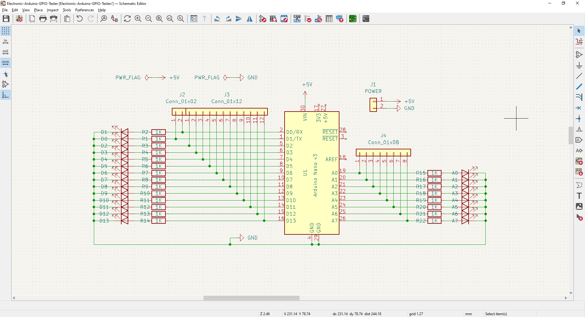
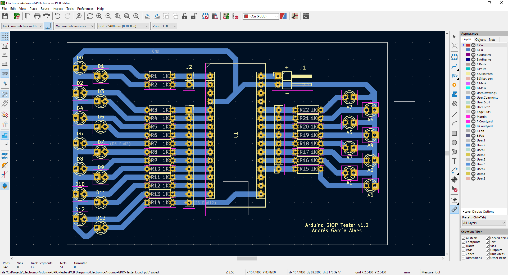

# Arduino GPIO Tester (Work-In-Progress)

Electronic proyect for easy test of Arduino Nano/UNO analog and digital (GPIO) pins.  

&nbsp;

This project use the following electronic components:
- 1 x Arduino Nano v3.0
- 2 x Connector pins
- 22 x LED 5mm
- 22 x 2k ohm resistors

&nbsp;

### Screenshots

| Diagram - Schematics                            | Diagram - PCB                                   |
|-------------------------------------------------|-------------------------------------------------|
|          |                |

| Diagram - PCB Render                            | Diagram - PCB Render                            |
|-------------------------------------------------|-------------------------------------------------|
|      |       |

| Prototype                                       | PCB Manufacturing                               |
|-------------------------------------------------|-------------------------------------------------|
|          |          |

| PCB Assembly                                    | Project Assembly                                |
|-------------------------------------------------|-------------------------------------------------|
|          |          |

| Project Final                                   | Project Final (YouTube video)                   |
|-------------------------------------------------|-------------------------------------------------|
|          |          |

See 'Rescources' sub-folder for more pictures & videos of the project.

&nbsp;

### Version History

v1.0 (2023.05.13) - Initial release.  

&nbsp;

This source code is licensed under GPL v3.0  
Please send me your feedback about this project: andres.garcia.alves@gmail.com
